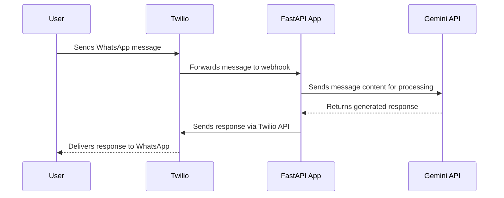

# WhatsApp Chatbot with Gemini

## Overview

This project is a WhatsApp chatbot powered by Google's Gemini model. It uses the Twilio API for handling WhatsApp messaging and a FastAPI server to process incoming messages and interact with the Gemini API.

## Architecture Flow

The following diagram illustrates the flow of a message from the user to the chatbot and back:



## Installation Guide

Follow these steps to set up and run the project on your local machine.

### Prerequisites

- Python 3.7+
- A Twilio account with a configured WhatsApp sandbox.
- A Google Gemini API key.
- [ngrok](https://ngrok.com/) for local development to expose your local server to the internet.

### 1. Clone the Project

Clone this project to your local machine.

### 2. Create a Virtual Environment

It is recommended to use a virtual environment to manage the project's dependencies.

```bash
# Create the virtual environment
python -m venv .venv

# Activate the virtual environment
# On Windows:
.venv\Scripts\activate
# On macOS/Linux:
# source .venv/bin/activate
```

### 3. Install Dependencies

Install the required Python packages using pip:

```bash
pip install -r requirements.txt
```

### 4. Set Up Environment Variables

Create a file named `.env` in the root directory of the project and add the following environment variables. Replace the placeholder values with your actual credentials.

```
GEMINI_API_KEY=your_gemini_api_key
TWILIO_ACCOUNT_SID=your_twilio_account_sid
TWILIO_AUTH_TOKEN=your_twilio_auth_token
FROM_WHATSAPP_NUMBER=whatsapp:your_twilio_whatsapp_number
```

## Usage

### 1. Run the FastAPI Server

Start the FastAPI application using `uvicorn`:

```bash
uvicorn main:app --reload
```

The server will be running on `http://127.0.0.1:8000`.

### 2. Expose Your Local Server

Use `ngrok` to create a public URL for your local server.

```bash
ngrok http 8000
```

`ngrok` will provide you with a public forwarding URL (e.g., `https://<unique-subdomain>.ngrok.io`).

### 3. Configure the Twilio Webhook

1.  Go to your [Twilio Console](https://www.twilio.com/console).
2.  Navigate to the WhatsApp sandbox settings.
3.  In the **"When a message comes in"** field, enter the public URL provided by `ngrok`, followed by `/webhook` (e.g., `https://<unique-subdomain>.ngrok.io/webhook`).
4.  Ensure the request method is set to `HTTP POST`.
5.  Save the changes.

### 4. Test the Chatbot

Send a message to your Twilio WhatsApp number from your phone. The chatbot should now respond to your messages.
